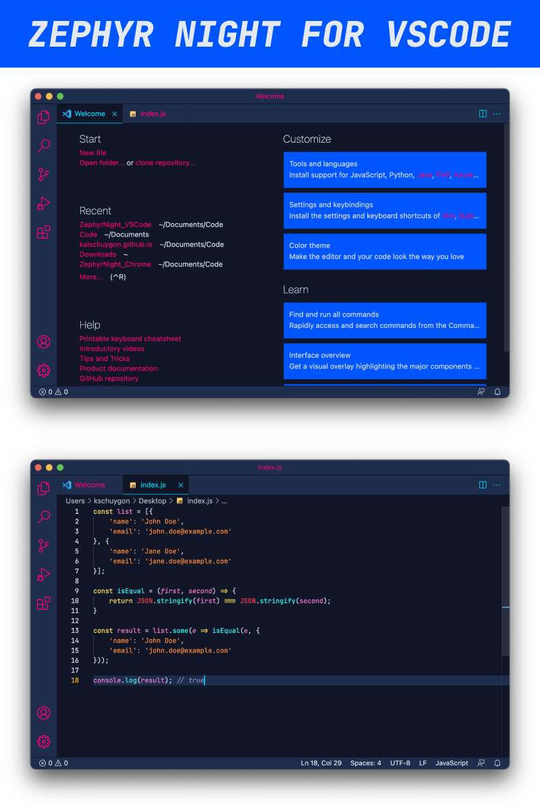

A dark theme for VSCode

## Installation
This theme is available for free in the [Visual Studio Code Marketplace](https://marketplace.visualstudio.com/items?itemName=kaischuygon.zephyrnight).

## Issues
If you find any issues, please post in the [issues tab](https://github.com/kaischuygon/ZephyrNight_VSCode/issues), I will try to resolve it as soon as I can.

## More
* If you like this theme, please [rate it](https://marketplace.visualstudio.com/items?itemName=kaischuygon.zephyrnight&ssr=false#review-details)!
* Get the matching theme for chromium-based browsers: [Zephyr Night for Chrome](https://github.com/kaischuygon/ZephyrNight_Chrome)
* Get the matching theme for Firefox browsers: [Zephyr Night for Firefox](https://github.com/kaischuygon/ZephyrNight_Firefox)
